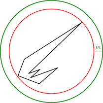

# Bounding Sphere

The `bounding_volume::BoundingSphere` is a sphere that contains completely the
bounded geometry.

Being an unorientable shape, it is completely defined by its center and its
radius:

| Method   | Description                                                    |
|--        | --                                                             |
| `center()` | The bounding sphere center. |
| `radius()` | The bounding sphere radius. |

The bounding sphere implements the `LooseBoundingVolume` trait so it can be
enlarged by an arbitrary thickness $m$:

## Creating a Bounding Sphere

There are two ways to create a bounding sphere. The main one is to use the usual
static method `BoundingSphere::new(center, radius)`.

The second method is using the `HasBoundingSphere` trait implemented by any
`Geom`:

| Method               | Description                                                |
|--                    | --                                                         |
| `bounding_sphere(m)` | Computes the bounding sphere of `self` transformed by `m`. |

This is the simplest way to compute the bounding sphere of a geometry defined
by **ncollide**. Do not forget to explicitely `use` the trait in order to be
allowed call this method `use ncollide::bounding_volume::HasBoundingSphere`!

## Working example

The following example computes bounding sphere of two boxes, merges them
together and performs some tests.

##### 3D
##### 2D
