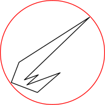

# Bounding Sphere

The `bounding_volume::BoundingSphere` is a sphere that contains completely the
bounded geometry.

<center>

</center>

Being an unorientable shape, it is completely defined by its center and its
radius:

| Method      | Description                                                    |
|--           | --                                                             |
| `.center()` | The bounding sphere center. |
| `.radius()` | The bounding sphere radius. |


The bounding sphere implements the `LooseBoundingVolume` trait so it can be
enlarged by an arbitrary margin $$m$$:

<center>

</center>

## Creating a Bounding Sphere

There are two ways to create a bounding sphere. The main one is to use the usual
static method `BoundingSphere::new(center, radius)`.


The second method is using the `bounding_volume::HasBoundingSphere` trait
implemented by any `Geom`:

| Method                | Description                                                |
|--                     | --                                                         |
| `.bounding_sphere(m)` | Computes the bounding sphere of `self` transformed by `m`. |

This is the simplest way to compute the bounding sphere of a geometry defined
by **ncollide**. Do not forget to explicitly import the trait in order to be
allowed call this method: `use ncollide::bounding_volume::HasBoundingSphere`!

## Working example

The following examples compute the bounding spheres of a cone and a cylinder,
merges them together, creates an enlarged version of the cylinder bounding
sphere, and performs some tests.

###### 2D example <div class="d2" onclick="window.open('../src/bounding_sphere2d.rs')"></div>
```rust
let cone     = Cone::new(0.5, 0.5);
let cylinder = Cylinder::new(1.0, 0.5);

let cone_pos     = Iso2::new(Vec2::y(), na::zero());
let cylinder_pos = na::one();

let bounding_sphere_cone     = cone.bounding_sphere(&cone_pos);
let bounding_sphere_cylinder = cylinder.bounding_sphere(&cylinder_pos);

let bounding_bounding_sphere = bounding_sphere_cone.merged(&bounding_sphere_cylinder);

let loose_bounding_sphere_cylinder = bounding_sphere_cylinder.loosened(1.0);

assert!(bounding_sphere_cone.intersects(&bounding_sphere_cylinder));
assert!(bounding_bounding_sphere.contains(&bounding_sphere_cone));
assert!(bounding_bounding_sphere.contains(&bounding_sphere_cylinder));
assert!(!bounding_sphere_cylinder.contains(&bounding_bounding_sphere));
assert!(!bounding_sphere_cone.contains(&bounding_bounding_sphere));
assert!(loose_bounding_sphere_cylinder.contains(&bounding_sphere_cylinder));
```

###### 3D example <div class="d3" onclick="window.open('../src/bounding_sphere3d.rs')"></div>
```rust
let cone     = Cone::new(0.5, 0.5);
let cylinder = Cylinder::new(1.0, 0.5);

let cone_pos     = Iso3::new(Vec3::z(), na::zero());
let cylinder_pos = na::one();

let bounding_sphere_cone     = cone.bounding_sphere(&cone_pos);
let bounding_sphere_cylinder = cylinder.bounding_sphere(&cylinder_pos);

let bounding_bounding_sphere = bounding_sphere_cone.merged(&bounding_sphere_cylinder);

let loose_bounding_sphere_cylinder = bounding_sphere_cylinder.loosened(1.0);

assert!(bounding_sphere_cone.intersects(&bounding_sphere_cylinder));
assert!(bounding_bounding_sphere.contains(&bounding_sphere_cone));
assert!(bounding_bounding_sphere.contains(&bounding_sphere_cylinder));
assert!(!bounding_sphere_cylinder.contains(&bounding_bounding_sphere));
assert!(!bounding_sphere_cone.contains(&bounding_bounding_sphere));
assert!(loose_bounding_sphere_cylinder.contains(&bounding_sphere_cylinder));
```
