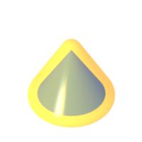

# Geometric definitions 
The definition of geometric objects forms the core of a geometric library.
Different definitions will lead to different kind of algorithms. At the moment
**ncollide** relies a lot on convex geometries described by a support function.
However, working exclusively this kind of shape would be too restrictive. This
is why **ncollide** provides the
[Compound](geometric_definitions/composite_geometries.html) geometry that
allows the construction of concave geometry from its convex parts, and
[Meshes](geometric_definitions/composite_geometries.html) that allow the
construction of concave shapes from triangles (in 3d) or segments (in 2d). In
addition, we are currently working on parametric surfaces (starting with Bézier
surfaces).

## Traits
The main trait, that is implemented by every single geometry is the `Geom`
trait. It requires each implementor to implement some other traits:
* `HasAABB` − an [Axis Aligned Bounding Box](../bounding_volumes/aabb.html) must
  be computable for the implementor.
* `HasBoundingSphere` − a
  [BoundingSphere](../bounding_volumes/bounding_sphere.html) must be computable
  for the implementor.
* `RayCast` − the computation of [intersections](../ray_casting/README.html)
  between a ray and the implementor must be possible (at the moment some
  implementation just return `None`).

The `Volumetric` trait, though not required by `Geom`, is implemented for most
geometry. It exposes methods that compute the mass, center of mass, angular
inertia tensor of the implementor. For some shape like the `Plane`, it is not
implemented because it is meaningless.

## Support map
**ncollide** supports generic algorithms that work for any (possibly
user-defined) shape defined by a support map. Those algorithms include
collision detection algorithms, and ray casting.  The support map is a function
that returns the point that maximises the dot product with a given
direction:

This can be seen as a function that returns the point of the support mapped
shape that is "the furthest on the given direction". Such function is enough to
describe completely a convex object.  Here is an example of support points for
the shapes $\mathcal{A}, \mathcal{B}$ and $\mathcal{C}$, given two directions
($\bf u$ and $\bf v$):

The support mapping function is exposed by the `Implicit` trait.

| Method                           | Description |
|--                                | --          |
| `support_point(m, v)`            | Computes the support point of the caller transformed by the transformation matrix `m`, in the direction `v`. |
| `support_point_with_margin(...)` | Same as `support_point(...)` but ignores the object's margin if it has one. |

Some of those methods refer to the notion of `margin`. This is explained by the
next section.

## Margins
For performance and accuracy reasons, most shapes are affected by something
called their `margin`. A margin has a `radius` and acts like a ball that is
used to erode or dilate the affected shape. Each shape has one of the two kinds
of margins:
* _internal_ margin − objects with an internal margin are eroded by a ball with
  a radius equal to the margin. The `Ball`, `Capsule` and `Cuboid` have an
  internal margin equal to their radius.
* _external_ margin − objects with an external margin are dilated by a ball
  with a radius equal to the margin. Every shape that do not have an _internal_
  margin, have an _external_ one.

The next chapter describes each shape and shows how they are affected by the
margin. The illustrations will use two colors. The blue geometry is the one
that is affected by the internal margins (if applicable). The yellow geometry
is the one that is affected by the margin. For example, the `Cone` has an
external margin, so the yellow envelope is bigger and more "rounded" than the
blue one (which is the exact cone):

