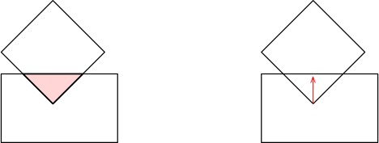

# Contact determination

Contact determination is the core feature of any collision detection library.
It is the process of determining if two objects are in contact. If they are,
the contact geometry is computed and stored into the `narrow::Contact`
structure:

| Field  | Description                                                              |
|--      | --                                                                       |
| `world1` | The contact point on the first object expressed in the absolute coordinate system. |
| `world2` | The contact point on the second object expressed in the absolute coordinate system. |
| `normal` | The contact normal expressed in the absolute coordinate system. It points toward the exterior of the first object. |
| `depth`  | The penetration depth of this contact. |

Here, _absolute coordinate system_ (sometimes called _world coordinate system_)
designs the set of axises that are not relative to any object.

The last field requires some explanations. Sometimes, the objects in contact
are penetrating each other. Notably, if you are using **ncollide** for physical
simulation, this is an unrealistic configuration where the matter of the two
objects are superimposed. This penetration can be expressed in several forms,
including the penetration volume (left), and the minimal translational distance
(right):

**ncollide** implements the last one: the minimal translational distance, also
known as the _penetration depth_. This is the smallest translation along the
contact normal needed to remove any overlap between the two objects interiors.

## Large scale contact determination
While detecting contacts between only two objects might be useful, we are often
interested to work with complex scenes involving thousands of objects that may
move. Iterating though each pair of object and testing each of them for
intersection is a $$O(n^2)$$ process which is not practicable in real-time.

To avoid this, the collision detection pipeline is usually decomposed into two
steps: the [broad phase](../contact_determination/broad_phase.html) and the
[narrow phase](../contact_determination/narrow_phase.html). The first one is
aware of the position of every object (i-e. not only two) so it can uses
spacial partitioning with conservative interference detection algorithms to
find all the potential collision pairs. The second phase iterates on all those
pairs and performs the exact contact determination. Note that the two objects
paired by the broad phase may not actually be in contact (_false positives_).
On the other hand, a broad phase is guaranteed not to produce _false
negatives_. Thus, two interfering objects are guaranteed to be paired.
