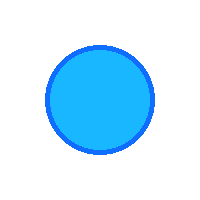
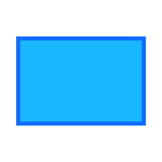
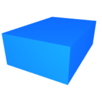
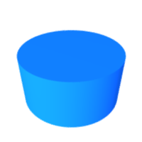
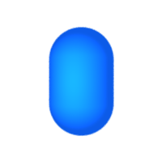
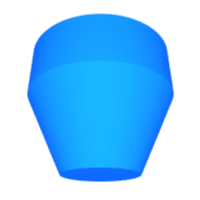
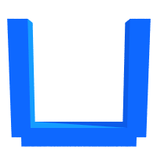
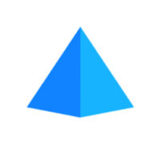

# Geometric representations
Different representations of geometric objects will lead to different
algorithms. At the moment **ncollide** relies a lot on convex shapes described
by a [support mapping](#support-mappings). However, working exclusively with
convex shapes is too restrictive so **ncollide** provides [composite
shapes](#composite-shapes) that allows the construction of a concave
shape from its convex parts.


Geometric primitives supported by **ncollide** are defined on the `shape`
module and share a common [dynamic representation](#dynamic-shape-representation).
Note that all geometric primitives have a predefined constant local frame to
the identity matrix. Thus, one usually has to store his own transformation
matrix separately from the shape itself in order to reach any position and
orientation.

# Support mappings

**ncollide** supports generic algorithms that work for any (possibly
user-defined) shape defined by a support map. The support map (argument) of a
shape $\mathcal{A}$ is a function that returns the point $\mathbf{p}$ that
maximises its dot product with a given direction $\mathbf{v}$. Such a point
point $s_{\mathcal{A}}(\mathbf{v})$ is called a _support point_:

$$
s_{\mathcal{A}}(\mathbf{v}) = \arg \max\limits_{\mathbf{p} \in \mathcal{A}} \left< \mathbf{p}, \mathbf{v} \right>
$$

If several point are eligible to be support points for a given direction
$\mathbf{v}$, any one of them has to be returned (preferably a corner). This
can be seen as a function that returns a point of the support mapped shape
which is _the furthest on the given direction_. Such a function is enough to
describe completely a convex object.  The following shows support points for
the shapes $\mathcal{A}, \mathcal{B}$ and $\mathcal{C}$, given two directions
$\mathbf u$ and $\mathbf v$:

<center>

</center>

The support mapping function is exposed by the `shape::SupportMap` trait.

| Method                            | Description |
|--                                 | --          |
| `.support_point(m, v)`            | Computes the support point of the caller transformed by the transformation matrix `m`, in the direction `v`. |

Most basic geometric primitives like balls, cubes, and cones, and more complex
ones like a Minkowski Sum of convex shapes can be described by their support
mappings. This allows a useful level of genericity for several geometric
queries on **ncollide**. Moreover, support mapping-based algorithms can also
operate on shapes embedded on a space of dimension higher than 3.

### Ball
Mathematically speaking, the `Ball` structure describes a closed ball on the
_n_-dimensional euclidean space. In two dimensions this is a disk, and in three
dimensions a sphere, both centered at the origin.


| Method | Description |
| --          | --       |
| `.radius()` | The radius of the ball. |

#### Example <div class="btn-primary" onclick="window.open('https://raw.githubusercontent.com/sebcrozet/ncollide/master/examples/ball.rs')"></div>

```rust
let ball = Ball::new(1.0f32);
assert!(ball.radius() == 1.0);
```

<center>


</center>

-----------

### Cuboid
The `Cuboid` structure describes a rectangle in two dimensions, or a cuboid in
three dimensions. A cuboid is defined by its _half extents_, i.e., its
half length along each coordinate axis.

| Method | Description |
| --          | --       |
| `.half_extents()` | The half extents of the cuboid. |

#### 2D example <div class="d2" onclick="window.open('https://raw.githubusercontent.com/sebcrozet/ncollide/master/examples/cuboid2d.rs')"></div>

```rust
let cuboid = Cuboid::new(Vector2::new(2.0f32, 1.0));

assert!(cuboid.half_extents().x == 2.0);
assert!(cuboid.half_extents().y == 1.0);
```

#### 3D example <div class="d3" onclick="window.open('https://raw.githubusercontent.com/sebcrozet/ncollide/master/examples/cuboid3d.rs')"></div>

```rust
let cuboid = Cuboid::new(Vector3::new(2.0f32, 1.0, 3.0));

assert!(cuboid.half_extents().x == 2.0);
assert!(cuboid.half_extents().y == 1.0);
assert!(cuboid.half_extents().z == 3.0);
```

<center>


</center>


-----------

### Cylinder
The `Cylinder` structure describes a rectangle in two dimensions, or a cylinder
in three dimensions. Its principal axis is the positive $\mathbf{y}$ axis.


| Method | Description |
| --       | --       |
| `.half_height()` | The half height of the cylinder. |
| `.radius()` | The radius of the cylinder basis. |

#### Example<div class="btn-primary" onclick="window.open('https://raw.githubusercontent.com/sebcrozet/ncollide/master/examples/cylinder.rs')"></div>
```rust
let cylinder = Cylinder::new(0.5f32, 1.0);

assert!(cylinder.half_height() == 0.5);
assert!(cylinder.radius() == 1.0);
```

<center>

</center>


-----------

### Cone
The `Cone` structure describes an isosceles triangle in two dimensions, or a
cone of revolution in tree dimensions. A cone is defined by the _radius_ of its
basis and its _half height_ − the half distance between the basis and the apex.
It points upward, its principal axis is the positive $\mathbf{y}$ axis, and its
apex has coordinates $(0, \text{cone.half_height()}, 0)$.

| Method | Description |
| --          | --       |
| `.half_height()` | The half height of the cone. |
| `.radius()` | The radius of the cone basis. |

#### Example<div class="btn-primary" onclick="window.open('https://raw.githubusercontent.com/sebcrozet/ncollide/master/examples/cone.rs')"></div>

```rust
let cone = Cone::new(0.5f32, 0.75);

assert!(cone.half_height() == 0.5);
assert!(cone.radius() == 0.75);
```

<center>


</center>

-----------

### Capsule
The `Capsule` structure describes the Minkowski sum of a segment and a ball. In
other words, this is a cylinder with its flat extremities replaced by
half-balls. A capsule is defined by its _half height_ and the _radius_ of its
extremities.  It is centered at the origin and principal axis is the positive
$\mathbf{y}$ axis.

| Method | Description |
| --          | --       |
| `.half_height()` | The half height of the capsule. |
| `.radius()` | The radius of the capsule extremities. |

#### Example <div class="btn-primary" onclick="window.open('https://raw.githubusercontent.com/sebcrozet/ncollide/master/examples/capsule.rs')"></div>
```rust
let capsule = Capsule::new(0.5f32, 0.75);

assert!(capsule.half_height() == 0.5);
assert!(capsule.radius() == 0.75);
```

<center>


</center>

-----------

### Convex hull
The `ConvexHull` structure represents the smallest convex envelope of a set of
point. Remember that an object is said to be convex if it is not self-crossing,
and if it contains any segment joining two of its points:

<center>

</center>

The `ConvexHull` shape is created from a set of points. Note that it does not
compute explicitly the convex hull of the points so its creation takes a
constant time.

| Method | Description  |
| --        | --           |
| `.points()`  | The points used to create the `ConvexHull` shape. |

#### 2D example<div class="d2" onclick="window.open('https://raw.githubusercontent.com/sebcrozet/ncollide/master/examples/convex2d.rs')"></div>
```rust
let points = vec![
    Point2::new(-1.0f32, 1.0), Point2::new(-0.5, -0.5),
    Point2::new(0.0, 0.5),     Point2::new(0.5, -0.5),
    Point2::new(1.0, 1.0)
];

let convex = ConvexHull::new(points);

// ConvexHull does not compute explicitly the convex hull (which has 4 vertices)!
assert!(convex.points().len() == 5);
```
<center>

</center>

#### 3D example<div class="d3" onclick="window.open('https://raw.githubusercontent.com/sebcrozet/ncollide/master/examples/convex3d.rs')"></div>
```rust
let points = vec![
    Point3::new(0.0f32, 0.0, 1.0),
    Point3::new(0.0, 0.0, -1.0),
    Point3::new(0.0, 1.0, 0.0),
    Point3::new(0.0, -1.0, 0.0),
    Point3::new(1.0, 0.0, 0.0),
    Point3::new(-1.0, 0.0, 0.0),
    Point3::new(0.0, 0.0, 0.0)
];

let convex = ConvexHull::new(points);

// ConvexHull does not compute explicitly the convex hull (which has 6 vertices)!
assert!(convex.points().len() == 7);
```
<center>

</center>

-----------

### Reflection
The `Reflection` structure describes the reflection of a shape $\mathcal{A}$
with regard to the origin:

$$
-\mathcal{A} = \left\{ -\mathbf{a} \mid{} \mathbf{a} \in \mathcal{A} \right\}
$$

Note that the reflected shape and the reflection itself are lifetime-bound so
it cannot be used to create a [shape handle](#dynamic-shape-representation).

| Method | Description |
| --       | --        |
| `.shape()` | The shape affected by the reflection. |

#### 2D and 3D example <div class="d3" onclick="window.open('https://raw.githubusercontent.com/sebcrozet/ncollide/master/examples/reflection3d.rs')"></div><div class="sp"></div><div class="d2" onclick="window.open('https://raw.githubusercontent.com/sebcrozet/ncollide/master/examples/reflection2d.rs')"></div>

```rust
let cone = Cone::new(0.5f32, 0.75);

// Build the reflection.
let _ = Reflection::new(&cone);
```

<center>


</center>

-----------

### Minkowski sum
The `MinkowskiSum` structure describes the Minkoswki sum of two shapes
implementing the `SupportMap` trait. If $\mathcal{A}$ and $\mathcal{B}$ are
two (possibly infinite) sets of points their Minkowski sum is given by the set:

$$
\mathcal{A} \oplus \mathcal{B} = \left\{ \mathbf{a} + \mathbf{b} \mid{} \mathbf{a} \in \mathcal{A}, \mathbf{b} \in \mathcal{B} \right\}
$$

In other words, this is the union of all points of one shape successively
translated by each point of the other one. This is extremely useful for
discrete and continuous collision detection. Note that `MinkowskiSum` does not
compute the sum explicitely so its construction is $\mathcal{O}(1)$. It is
lifetime-bound to the shapes involved on the sum so it cannot be used to create
a [shape handle](#dynamic-shape-representation).

| Method | Description |
| --       | --        |
| `.m1()` | The local transformation of the **first** shape involved in the sum. |
| `.m2()` | The local transformation of the **second** shape involved in the sum. |
| `.g1()` | The **first** shape involved in the sum. |
| `.g2()` | The **second** shape involved in the sum. |

#### 2D and 3D example <div class="d3" onclick="window.open('https://raw.githubusercontent.com/sebcrozet/ncollide/master/examples/minkowski_sum3d.rs')"></div><div class="sp"></div><div class="d2" onclick="window.open('https://raw.githubusercontent.com/sebcrozet/ncollide/master/examples/minkowski_sum2d.rs')"></div>

```rust
let cylinder = Cylinder::new(0.5f32, 0.75);
let cone     = Cone::new(0.75f32, 0.75);

let delta_cylinder = na::one::<Isometry3<f32>>(); // identity matrix.
let delta_cone     = na::one::<Isometry3<f32>>(); // identity matrix.

let _ = MinkowskiSum::new(&delta_cylinder, &cylinder, &delta_cone, &cone);
```

<center>


</center>

#### Configuration Space Obstacle construction example <div class="d3" onclick="window.open('https://raw.githubusercontent.com/sebcrozet/ncollide/master/examples/configuration_space_obstacle3d.rs')"></div><div class="sp"></div><div class="d2" onclick="window.open('https://raw.githubusercontent.com/sebcrozet/ncollide/master/examples/configuration_space_obstacle2d.rs')"></div>
The Configuration Space Obstacle (CSO) is the same as the Minkowski sum of the
first shape with the reflection of the second one:

$$
\mathcal{A} \ominus \mathcal{B} = \mathcal{A} \oplus -\mathcal{B} = \left\{ \mathbf{a} - \mathbf{b} \mid{} \mathbf{a} \in \mathcal{A}, \mathbf{b} \in \mathcal{B} \right\}
$$

This concept is extencively used, e.g., in robotics and interference detection
to compute all the impossible positions of the center of mass of an object that
evolves in a complex environment. Note that this is obviously **not** a
commutative operator. It can be constructed using the `MinkowskiSum` and
`Reflection` shapes:

```rust
let cylinder   = Cylinder::new(0.5f32, 0.75);
let cone       = Cone::new(0.75f32, 0.75);
let reflection = Reflection::new(&cone); // Take the reflection of the cone.

let delta_cylinder = na::one::<Isometry3<f32>>(); // identity matrix.
let delta_cone     = na::one::<Isometry3<f32>>(); // identity matrix.

// Build the Configuration Space Obstacle.
let _ = MinkowskiSum::new(&delta_cylinder, &cylinder, &delta_cone, &reflection);
```

<center>


</center>

# Composite shapes

**ncollide** supports shapes that are defined as aggregations of others. Every
composite shape must implement the `shape::CompositeShape` trait which defines
methods for accessing their individual parts using indices. Indices ranging
from 0 to `.len() - 1` are required to be valid. The composite is assumed to be
immutable, i.e., an index must always map to a shape and local transformation
that remain the same over time.

| Method | Description |
| --          | --        |
| `.len()` | The number of parts in the composite shape. |
| `.map_part_at(i, f)` | Applies the closure `f` to the `i`-th part and its local transformation matrix. |
| `.map_transformed_part_at(i, m, f)` | Applies the closure `f` to the `i`-th part and its local transformation matrix with `m` appended to it. |
| `.aabb_at(i)` | The `AABB` of the `i`-th part of the composite shape. |
| `.bvt()` | The space-partitioning acceleration structure used by the composite shape. |

Currently, three composite shapes are available on **ncollide**. The `Compound`
describes the union of any shape supported by **ncollide**. The `TriMesh`
and `Polyline` are optimized exclusively for assemblies of triangles and
segments.

### Compound
The `Compound` structure is the main way of describing concave shapes from
convex ones. It differs from `Mesh` in that it is not a set of triangles but a
set of any [shape handle](#dynamic-shape-representation).

| Method | Description |
| --          | --        |
| `.shapes()` | The shapes composing the compound. |
| `.bounding_volumes()` | The `AABB` of the shapes composing the compound. |
| `.bvt()` | The space-partitioning acceleration structure used by the compound. |


Two steps are necessary to create a `Compound`:

1. Initialize a vector of shape handles with their positions and orientation
   relative to the origin.
2. Call `Compound::new` with this vector.

#### 2D example <div class="d2" onclick="window.open('https://raw.githubusercontent.com/sebcrozet/ncollide/master/examples/compound2d.rs')"></div>
```rust
// Delta transformation matrices.
let delta1 = Isometry2::new(Vector2::new(0.0f32, -1.5), na::zero());
let delta2 = Isometry2::new(Vector2::new(-1.5f32, 0.0), na::zero());
let delta3 = Isometry2::new(Vector2::new(1.5f32,  0.0), na::zero());

// 1) Initialize the shape list.
let mut shapes = Vec::new();
let horizontal_box = ShapeHandle::new(Cuboid::new(Vector2::new(1.5f32,  0.25)));
let vertical_box   = ShapeHandle::new(Cuboid::new(Vector2::new(0.25f32, 1.5)));

shapes.push((delta1, horizontal_box));
shapes.push((delta2, vertical_box.clone()));
shapes.push((delta3, vertical_box));

// 2) Create the compound shape.
let compound = Compound::new(shapes);

assert!(compound.shapes().len() == 3)
```

<center>

</center>

#### 3D example <div class="d3" onclick="window.open('https://raw.githubusercontent.com/sebcrozet/ncollide/master/examples/compound3d.rs')"></div>
```rust
// Delta transformation matrices.
let delta1 = Isometry3::new(Vector3::new(0.0f32, -1.5, 0.0), na::zero());
let delta2 = Isometry3::new(Vector3::new(-1.5f32, 0.0, 0.0), na::zero());
let delta3 = Isometry3::new(Vector3::new(1.5f32, 0.0,  0.0), na::zero());

// 1) Initialize the shape list.
let mut shapes = Vec::new();
let horizontal_box = ShapeHandle::new(Cuboid::new(Vector3::new(1.5f32,  0.25, 0.25)));
let vertical_box   = ShapeHandle::new(Cuboid::new(Vector3::new(0.25f32, 1.5, 0.25)));

shapes.push((delta1, horizontal_box));
shapes.push((delta2, vertical_box.clone()));
shapes.push((delta3, vertical_box));

// 2) Create the compound shape.
let compound = Compound::new(shapes);

assert!(compound.shapes().len() == 3)
```

<center>

</center>

-----------

### Polyline and TriMesh
The `Polyline` and `TriMesh` structures describe a set of segments and a mesh
of triangles. They are constructed from shared arrays of vertices and indices.
Each segment (resp. triangle) is identified by two (resp. three) indices. It is
also possible to provide one normal and one texture coordinate per vertex;
those are not used for contact determination but are useful for, e.g.,
ray-tracing applications.

| Method | Description |
| --          | --       |
| `.vertices()` | The vertex buffer. |
| `.indices()` | The index  buffer.  |
| `.normals()` | The normal buffer. |
| `.uvs()` | The texture coordinates buffer. |
| `.bounding_volumes()` | The bounding volume of each primitive (segment or triangle). |
| `.bvt()` | The space-partitioning acceleration structure used by the mesh. |


#### 2D example<div class="d2" onclick="window.open('https://raw.githubusercontent.com/sebcrozet/ncollide/master/examples/mesh2d.rs')"></div>

```rust
let points = vec!(
    Point2::new(0.0, 1.0),  Point2::new(-1.0, -1.0),
    Point2::new(0.0, -0.5), Point2::new(1.0, -1.0));

let indices = vec!(Point2::new(0usize, 1),
                   Point2::new(1, 2),
                   Point2::new(2, 3),
                   Point2::new(3, 1));

// Build the polyline.
let polyline = Polyline::new(Arc::new(points), Arc::new(indices), None, None);

assert!(polyline.vertices().len() == 4);
```

<center>

</center>


#### 3D example<div class="d3" onclick="window.open('https://raw.githubusercontent.com/sebcrozet/ncollide/master/examples/mesh3d.rs')"></div>

```rust
let points = vec!(
    Point3::new(0.0, 1.0, 0.0), Point3::new(-1.0, -0.5, 0.0),
    Point3::new(0.0, -0.5, -1.0), Point3::new(1.0, -0.5, 0.0));

let indices = vec!(Point3::new(0usize, 1, 2),
                   Point3::new(0, 2, 3),
                   Point3::new(0, 3, 1));

// Build the mesh.
let mesh = TriMesh::new(Arc::new(points), Arc::new(indices), None, None);

assert!(mesh.vertices().len() == 4);
```

<center>

</center>

# Other shapes
Some shapes do not fall into any of the general categories described above.

### Plane
The `Plane` structure describes a solid closed half-space. The border of a
plane contains the origin and is defined by its _normal_. Every point that has
a negative or null dot product with the plane normal is considered _inside_ of
it. Other points are _outside_ of the plane.

| Method   | Description  |
| --          | --        |
| `.normal()` | The normal of the plane. |

#### 2D example<div class="d2" onclick="window.open('https://raw.githubusercontent.com/sebcrozet/ncollide/master/examples/plane2d.rs')"></div>
```rust
let plane = Plane::new(Vector2::new(0.0f32, 1.0));

assert!(plane.normal().x == 0.0);
assert!(plane.normal().y == 1.0);
```

#### 3D example<div class="d3" onclick="window.open('https://raw.githubusercontent.com/sebcrozet/ncollide/master/examples/plane3d.rs')"></div>
```rust
let plane = Plane::new(Vector3::new(0.0f32, 1.0, 0.0));

assert!(plane.normal().x == 0.0);
assert!(plane.normal().y == 1.0);
assert!(plane.normal().z == 0.0);
```

# Dynamic shape representation

In order to select the right algorithms for geometric queries on specific
shapes, `ncollide` has to be able to distinguish at runtime different shapes
from their types and they capabilities.  As described
[later](../geometric_queries) in this guide, there are two kinds of geometric
queries: those that operate on a [single
shape](../geometric_queries/#single-shape-queries) and those that operate on
[two shapes](../geometric_queries/#pairwise-queries) simultaneously.  In the
first case, runtime algorithm selection is performed with the help of traits
which can be easily implemented for user-defined shapes and exposed at runtime
by a `Shape` trait-object. On the other hand, queries involving two shapes
require more complex dispatch mechanisms that are not yet fully customizable by
the user. At the moment, only **persistant** pairwise geometric queries
performed by the [collision detection
pipeline](../collision_detection_pipeline) are customizable by changing some of
its components.
.


### The ShapeHandle
Elements to inspect shape representation and capabilities are provided for each
shape by implementing the `shape::Shape` trait. The `shape::ShapeHandle`
structure is nothing more than a `Shape` trait-object wrapped into an `Arc`.

| Method                    | Description |
|--                         | --          |
| `.aabb(m: &M)`            | The AABB of the shape transformed by `m`.            |
| `.bounding_sphere(m: &M)` | The bounding sphere of the shape transformed by `M`. |
| `.as_ray_cast()`          | Converts `self` to a `RayCast` trait-object.         |
| `.as_point_query()`       | Converts `self` to a `PointQuery` trait-object.      |
| `.as_support_map()`       | Converts `self` to a `SupportMap` trait-object.      |
| `.as_composite_shape()`   | Converts `self` to a `ComposteShape` trait-object.   |
| `.is_support_map()`       | Returns `true` if this shape has a support-mapping.  |
| `.is_composite_shape()`   | Returns `true` if this shape is a composite shape.   |

All the conversion methods have a default implementation returning `None`.
This allows you to only partially implement the trait if some of those features
are of no interest to you or even not applicable for your specific shape. For
example it is extremely rare to implement both `.as_composite_shape()` and
`.as_support_map()` as algorithms applicable to the latter will almost always
be more efficient than for the former.

Methods related to bounding volumes have default implementations as well
except for AABB construction. AABBs are widely used throughout **ncollide** so
their tightness is critical for good performances. Other bounding volumes are
less used so by default they are deduced from the AABB itself. Those default
implementations will unfortunately only result in very loose bounding volumes
so it is advised to provide your own to ensure optimal performances.

### Custom support-mapped shape <div class="btn-primary" onclick="window.open('https://raw.githubusercontent.com/sebcrozet/ncollide/master/examples/custom_support_map.rs')"></div>
In this section we detail an example to define your own support-mapped shape
suitable to be wrapped into a `ShapeHandle`. Too keep the maths simple, we will
define a simple 2-dimensional ellipse centered at the origin with radius $a$
and $b$:

<center>

</center>

```rust
struct Ellipse {
    a: f32, // The first radius.
    b: f32  // The second radius.
}
```

We first have to define its support mapping.  Let $\mathcal{F}$ be an ellipse.
The implicit equation of the border of an ellipse centered at the origin is
given by $f(x, y) = \left(\frac{x}{a}\right)^2 + \left(\frac{y}{b}\right)^2 - 1
= 0$. Therefore its gradient is simply $\nabla{}f(x, y) = \left[
\frac{2x}{a^2}, \frac{2y}{b^2} \right]^\intercal$.  Then, for some direction
$\mathbf{v} = [ x_v, y_v ]^\intercal \in \mathbb{R}^2$, convex analysis tells
us that the point $ [ x^*, y^* ]^\intercal \in \mathcal{F}$ that maximizes or
minimizes the dot product with $\mathbf{v}$ is such that $v \times
\nabla{}f(x^*, y^*) = \frac{x_vy^*}{b^2} - \frac{y_vx^*}{a^2} = 0$. Thus, we
have to solve the quadratic algebraic system:

$$
\left\{
\begin{array}{lcl}
    \frac{x_v y^*}{b^2} - \frac{y_vx^*}{a^2} & = & 0\\
    \left(\frac{x^*}{a}\right)^2 + \left(\frac{y^*}{b}\right)^2 - 1 & = & 0
\end{array}
\right.
$$

The solutions of this system are $[ x^*, y^* ]^\intercal = \pm{}\left[ \frac{x_v a^2}{\sqrt{x_v^2 a^2 + y_v^2 b^2}}, \frac{y_vb^2}{\sqrt{x_v^2 a^2 + y_v^2 b^2}} \right]^\intercal$.
Among those two solutions, the maximizer is the first one (with the leading $+$ sign).
Now, we only have to code this into a `SupportMap` implementation for our
`Ellipse`.

```rust
impl SupportMap<Point2<f32>, Isometry2<f32>> for Ellipse {
    fn support_point(&self, transform: &Isometry2<f32>, dir: &Vector2<f32>) -> Point2<f32> {
        // Bring `dir` into the ellipse's local frame.
        let local_dir = transform.inverse_rotate(&dir);

        // Compute the denominator.
        let denom = f32::sqrt(local_dir.x * local_dir.x * self.a * self.a +
                              local_dir.y * local_dir.y * self.b * self.b);

        // Compute the support point into the ellipse's local frame.
        let local_support_point = Point2::new(self.a * self.a * local_dir.x / denom,
                                              self.b * self.b * local_dir.y / denom);

        // Return the support point transformed back into the global frame.
        *transform * local_support_point
    }
}
```

With this, we will be able to pass an instance of `Ellipse` to many geometric
queries from the `geometry::algorithms` module and all the functions with names
that contains `support_map` on the other submodules of the `geometry` module.
If we want to benefit from a higher-level interface based on the dynamic
dispatch mechanism on **ncollide**, we have to implement the `Shape` trait
providing at least an AABB and a conversion to the `SupportMap` trait-object:

```rust
impl Shape<Point2<f32>, Isometry2<f32>> for Ellipse {
    fn aabb(&self, m: &Isometry2<f32>) -> AABB2<f32> {
        // Generic method to compute the aabb of a support-mapped shape.
        bounding_volume::support_map_aabb(m, self)
    }

    fn as_support_map(&self) -> Option<&SupportMap2<f32>> {
        Some(self)
    }
}
```

That's it! You will now be able to pass our ellipse to various functions of
the `geometry` module, and even wrap it on a `ShapeHandle` to use it as a
`CollisionObject` shape for complex interactions with a `CollisionWorld` using
the [collision detection pipeline](../collision_detection_pipeline). The
following is an example of some pairwise [geometric
queries](../geometric_queries/#pairwise-queries) involving our own ellipse:

```rust
let ellipse = Ellipse { a: 2.0f32, b: 1.0 };
let cuboid  = Cuboid::new(Vector2::new(1.0, 1.0));

let ellipse_pos = na::one();
let cuboid_pos  = Isometry2::new(Vector2::new(4.0, 0.0), na::zero());

let dist = query::distance(&ellipse_pos, &ellipse, &cuboid_pos, &cuboid);
let prox = query::proximity(&ellipse_pos, &ellipse, &cuboid_pos, &cuboid, 0.0);
let ctct = query::contact(&ellipse_pos, &ellipse, &cuboid_pos, &cuboid, 0.0);

assert!(na::approx_eq(&dist, &1.0));
assert_eq!(prox, Proximity::Disjoint);
assert!(ctct.is_none());
```

### Custom composite shape <div class="btn-primary" onclick="window.open('https://raw.githubusercontent.com/sebcrozet/ncollide/master/examples/custom_composite_shape.rs')"></div>
In this section we detail an example to define your own composite shape
suitable to be wrapped into a `ShapeHandle`.  We will define a simple 2D
cross-shaped object with only two part:

1. A Cuboid of width 4 and height 2.
2. A Cuboid of width 2 and height 4.

Both will be centered at the point (1, 1):

<center>

</center>

Because the two parts are very simple, we will generate them on-the-fly when
needed by the user. Only the acceleration structure will be precomputed.

```rust
struct CrossedCuboids {
    bvt: BVT<usize, AABB2<f32>>
}

impl CrossedCuboids {
    pub fn new() -> CrossedCuboids {
        // The shape indices paired with their corresponding AABBs.
        // Nedded to initialize the acceleration structure.
        let aabbs = vec! [
            (0, CrossedCuboids::generate_aabb(0)),
            (1, CrossedCuboids::generate_aabb(1))
        ];

        CrossedCuboids {
            bvt: BVT::new_balanced(aabbs)
        }
    }

    // Helper function to generate the AABB bounding the i-th cuboid.
    fn generate_aabb(i: usize) -> AABB2<f32> {
        if i == 0 {
            // The AABB for the horizontal cuboid.
            AABB2::new(Point2::new(-1.0, 0.0), Point2::new(3.0, 2.0))
        }
        else {
            // The AABB for the vertical cuboid.
            AABB2::new(Point2::new(0.0, -1.0), Point2::new(2.0, 3.0))
        }
    }

    // Helper function to generate the i-th cuboid.
    fn generate_cuboid(i: usize) -> Cuboid2<f32> {
        if i == 0 {
            // Create a 4x2 cuboid. Remember that we must provide the
            // half-lengths.
            Cuboid2::new(Vector2::new(2.0, 1.0))
        }
        else {
            // Create a 2x4 cuboid. Remember that we must provide the
            // half-lengths.
            Cuboid2::new(Vector2::new(1.0, 2.0))
        }
    }
}
```

Now we have to implement the `CompositeShape` trait.

```rust
impl CompositeShape<Point2<f32>, Isometry2<f32>> for CrossedCuboids {
    fn len(&self) -> usize {
        2 // There are only two parts.
    }

    fn map_part_at(&self, i: usize, f: &mut FnMut(&Isometry2<f32>, &Shape2<f32>)) {
        // The translation needed to center the cuboid at the point (1, 1).
        let transform = Isometry2::new(Vector2::new(1.0, 1.0), na::zero());

        // Create the cuboid on-the-fly.
        let cuboid = CrossedCuboids::generate_cuboid(i);

        // Call the function.
        f(&transform, &cuboid)
    }

    fn map_transformed_part_at(&self,
                               i: usize,
                               m: &Isometry2<f32>,
                               f: &mut FnMut(&Isometry2<f32>, &Shape2<f32>)) {
        // Prepend the translation needed to center the cuboid at the point (1, 1).
        let transform = m.prepend_translation(&Vector2::new(1.0, 1.0));

        // Create the cuboid on-the-fly.
        let cuboid = CrossedCuboids::generate_cuboid(i);

        // Call the function.
        f(&transform, &cuboid)
    }

    fn aabb_at(&self, i: usize) -> AABB2<f32> {
        // Compute the i-th AABB.
        CrossedCuboids::generate_aabb(i)
    }

    fn bvt(&self) -> &BVT<usize, AABB2<f32>> {
        // Reference to the acceleration structure.
        &self.bvt
    }
}
```

Note that the requirement to use a `BVT` as an internal acceleration structure
is too restrictive and will be removed in future versions of **ncollide**.

Just like in the previous section, implementing the `CompositeShape` trait is
enough to use some pairwise geometric queries, e.g., those from the submodule
of `geometry` module with names that contains the word `composite`. For a more
complete integration, we have to implement the `Shape` trait providing at least
an AABB and a conversion to the `CompositeShape` trait-object:

```rust
impl Shape<Point2<f32>, Isometry2<f32>> for CrossedCuboids {
    fn aabb(&self, m: &Isometry2<f32>) -> AABB2<f32> {
        // This is far from an optimal AABB.
        AABB2::new(Point2::new(-10.0, -10.0) + m.translation(),
                   Point2::new(10.0, 10.0)   + m.translation())
    }

    fn as_composite_shape(&self) -> Option<&CompositeShape2<f32>> {
        Some(self)
    }
}
```

That's it! You will now be able to pass our cross-like shape to various
functions of the `geometry` module, and even wrap it on a `ShapeHandle` to use
it as a `CollisionObject` shape for complex interactions with a
`CollisionWorld` using the [collision detection
pipeline](../collision_detection_pipeline). The following is an example of some
pairwise [geometric queries](../geometric_queries/#pairwise-queries)
involving our own composite shape:

```rust
let cross  = CrossedCuboids::new();
let cuboid = Cuboid2::new(Vector2::new(1.0, 1.0));

let cross_pos  = na::one();
let cuboid_pos = Isometry2::new(Vector2::new(6.0, 0.0), na::zero());

let dist = query::distance(&cross_pos, &cross, &cuboid_pos, &cuboid);
let prox = query::proximity(&cross_pos, &cross, &cuboid_pos, &cuboid, 0.0);
let ctct = query::contact(&cross_pos, &cross, &cuboid_pos, &cuboid, 0.0);

assert!(na::approx_eq(&dist, &2.0));
assert_eq!(prox, Proximity::Disjoint);
assert!(ctct.is_none());
```
