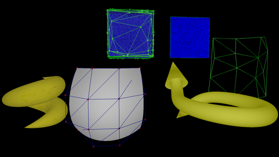

 

-----

2D and 3D collision detection library

… for the [Rust](https://www.rust-lang.org) programming language.

 

<table markdown="1">
<tr>
    <td></td>
    <td style="vertical-align:middle">
    <a href="../geometric_representations" id="no_highlight">
    

    <big>**Complex shapes**</big>
     
    Complex geometric queries for collision detection are available for 2D and
    3D shapes with various levels of complexity: from simple spheres to
    arbitrary triangle meshes and unions of convex shapes.
    

    </a>
    </td>
</tr>
<tr>
    <td></td>
    <td style="vertical-align:middle">
    <a href="../bounding_volumes" id="no_highlight">
    

    <big>**Bounding volumes**</big>
     
    Complex shapes may be approximated by simpler ones like AABB and bounding
    spheres. Those can be used for approximating some geometric queries
    efficiently and avoid useless exact computations.
    

    </a>
    </td>
</tr>
<tr>
    <td></td>
    <td style="vertical-align:middle">
    <a href="../geometric_queries/#ray-casting" id="no_highlight">
    

    <big>**Ray casting**</big>
     
    Computation of intersection between a ray and any shape.
    

    </a>
    </td>
</tr>
<tr>
    <td></td>
    <td style="vertical-align:middle">
    <a href="../geometric_queries/#point-projection" id="no_highlight">
    

    <big>**Point projection**</big>
     
    Point containment test, distance to point, and point projection on any
    shape.
    

    </a>
    </td>
</tr>
<tr>
    <td></td>
    <td style="vertical-align:middle">
    <a href="../geometric_queries/#contact" id="no_highlight">
    

    <big>**Contact points**</big>
     
    Find the closest points between objects in close proximity.  If they are
    penetrating, the minimal translational distance can be obtained as well!
    

    </a>
    </td>
</tr>
<tr>
    <td></td>
    <td style="vertical-align:middle">
    <a href="../geometric_queries/#time-of-impact" id="no_highlight">
    

    <big>**Time-of-impact**</big>
     
    Compute the time it would take for two moving shapes to start being in
    contact.
    

    </a>
    </td>
</tr>
<tr>
    <td></td>
    <td style="vertical-align:middle">
    <a href="../geometric_queries/#distance" id="no_highlight">
    

    <big>**Smallest distance**</big>
     
    Compute the global minimal distance between two shapes.
    

    </a>
    </td>
</tr>
<tr>
    <td></td>
    <td style="vertical-align:middle">
    <a href="../bounding_volumes/#spacial-partitioning" id="no_highlight">
    

    <big>**Spacial partitioning**</big>
     
    Efficient data structures to perform geometric queries efficiently on
    thousands of objects.
    

    </a>
    </td>
</tr>
<tr>
    <td></td>
    <td style="vertical-align:middle">
    <a href="../collision_detection_pipeline" id="no_highlight">
    

    <big>**Collision detection pipeline**</big>
     
    A complete and efficient collision detection pipeline including a broad
    phase and a narrow phase. Enables real-time contacts generation, proximity events,
    ray-casting and more, for scenes with hundreds of objects.
    

    </a>
    </td>
</tr>
<tr>
    <td></td>
    <td style="vertical-align:middle">
    <a href="../mesh_generation" id="no_highlight">
    

    <big>**Mesh generation**</big>
     
    Generate triangle meshes from smooth objects, compute their convex hull, or
    decompose them approximately into their convex components.
    

    </a>
    </td>
</tr>
</table>

----

## Demonstrations

<big>[**nphysics**](http://nphysics.org)</big> − a 2D and 3D physics engine
available on [crates.io](http://crates.io) as the `nphysics2d` and `nphysics3d`
crates.  It completely relies on **ncollide** for contact points computation
and proximity detection. It has at least one example per collision detection
algorithm provided by **ncollide**.

<iframe width="560" height="315" src="http://www.youtube.com/embed/CANjXZ5rocI" frameborder="0" allowfullscreen></iframe>

<big>[**kiss3d**](http://kiss3d.org)</big> − a simplistic 3d graphics engine
available on [crates.io](http://crates.io). It relies on mesh generation to
render everything that is not triangular (sphere, cone, Bézier surfaces, etc.)
In particular it has a
[demo](https://github.com/sebcrozet/kiss3d/blob/master/examples/procedural.rs)
that uses most mesh generation algorithms of **ncollide**. In fact, every
single 3d illustration of the [Mesh generation](mesh_generation/index.html)
section has been rendered by **kiss3d**.

<big>[**nrays**](https://github.com/sebcrozet/nrays)</big> − a toy 3d and 4d
ray tracer in Rust. Obviously, it is used to stress-test the ray-casting
capabilities of **ncollide**. In fact, most 3d illustration of this guide have
been rendered by **nrays**.

-----

### Version 0.8.0
#### Added

* Added proximity queries, including persistant proximity detector and
  algorithm dispatcher.
* Added methods to set directly collision group membership/whitelist/blacklist.

#### Modified

* The last type parameter of the `BVTCostFn` trait (the user-defined data
  return by leaves) is now an associated type.
* The shape handles `Arc<Box<Repr<P, M>>>` are now wrapped into a structure
  with a more explicit name: `ShapeHandle<P, M>`.
* Renamed `Convex` to `ConvexHull`
* Swapped the first two arguments of `CompositeShape::map_transformed_part_at`.
* All fields of `Polyline` are now private. Added corresponding accessors.
