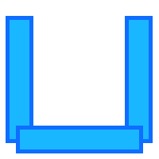
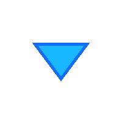
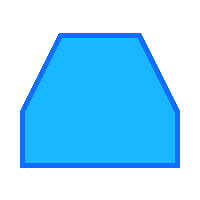
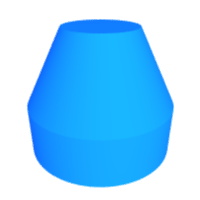
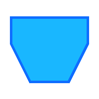

# Composite geometries

**ncollide** supports geometries that are defined from other geometries:
1. the `Compound` geometry that describes a concave geometry from convex ones.
2. the `Reflection` geometry that describes the reflection of another geometry.
3. the `MinkowskiSum` and `AnnotatedMinkowskiSum` geometries that describe the
   Minkowski sum of two geometries.

## Compound
The `Compound` structure is the main way of describing concave geometries from
convex ones. It differs from `Mesh` in that it is not a set of triangles but a
set of any geometry implementing the `Geom` trait. Two steps are necessary to
create a `Compound` geometry:
1. Initialize a `CompoundData` structure. Several geometries implementing the
   `Geom` trait, together with a delta transformation matrix can be added to
   the compound data.
2. Call `Compound::new` with the initialized compound data.

| Method | Description |
| --          | --        |
| `.geoms()` | The geometries composing the compound. |
| `.bounding_volumes()` | The AABBs of the geometries composing the compound. |
| `.bvt()` | The space-partitioning acceleration structure used by the compound. |

###### 2D example <div class="d2" onclick="window.open('../src/compound2d.rs')"></div>
```rust
// Delta transformation matrices.
let delta1 = Iso2::new(Vec2::new(0.0f32, -1.5), na::zero());
let delta2 = Iso2::new(Vec2::new(-1.5f32, 0.0), na::zero());
let delta3 = Iso2::new(Vec2::new(1.5f32,  0.0), na::zero());

// 1) Initialize the CompoundData.
let mut compound_data = CompoundData::new();
compound_data.push_geom(delta1, Cuboid::new(Vec2::new(1.5f32, 0.25)), 1.0);
compound_data.push_geom(delta2, Cuboid::new(Vec2::new(0.25f32, 1.5)), 1.0);
compound_data.push_geom(delta3, Cuboid::new(Vec2::new(0.25f32, 1.5)), 1.0);

// 2) Create the compound geometry.
let compound = Compound::new(compound_data);

assert!(compound.geoms().len() == 3)
```

<center>

</center>

###### 3D example <div class="d3" onclick="window.open('../src/compound3d.rs')"></div>
```rust
// Delta transformation matrices.
let delta1 = Iso3::new(Vec3::new(0.0f32, -1.5, 0.0), na::zero());
let delta2 = Iso3::new(Vec3::new(-1.5f32, 0.0, 0.0), na::zero());
let delta3 = Iso3::new(Vec3::new(1.5f32, 0.0,  0.0), na::zero());

// 1) Initialize the CompoundData.
let mut compound_data = CompoundData::new();
compound_data.push_geom(delta1, Cuboid::new(Vec3::new(1.5f32, 0.25, 0.25)), 1.0);
compound_data.push_geom(delta2, Cuboid::new(Vec3::new(0.25f32, 1.5, 0.25)), 1.0);
compound_data.push_geom(delta3, Cuboid::new(Vec3::new(0.25f32, 1.5, 0.25)), 1.0);

// 2) Create the compound geometry.
let compound = Compound::new(compound_data);

assert!(compound.geoms().len() == 3)
```

<center>

</center>

#### More about `CompoundData`
The previous examples show the simplest way of initializing the `CompoundData`
structure. However using the `compound_data.push_geom(...)` method works only
for geometries that implement both the `Geom` **and** the `Volumetric` traits.
In addition every geometry added with `push_geom(...)` are moved out. To save
memory, we might want those to be shared by multiple composite geometries.
Therefore, there are three ways of adding a geometry to a `CompoundData`:

1. `push_geom(...)`: use this if your geometry implements `Volumetric` and does
   *not* have to be shared.
2. `push_geom_with_mass_properties(...)`: use this if your geometry does *not*
   implement `Volumetric` and does *not* have to be shared. This time, the
   object surface, mass, center of mass and angular inertia tensor must be
   provided.
3. `push_shared_geom_with_mass_properties(...)`: use this if your geometry has
   to be shared.  This time, even if `shared_geometry` did implement the
   `Volumetric` trait, the object surface, mass, center of mass and angular
   inertia tensor must be provided.

###### 2D example <div class="d2" onclick="window.open('../src/compound_data2d.rs')"></div>
```rust
// delta transformation matrices.
let delta1 = Iso2::new(Vec2::new(0.0f32, -1.5), na::zero());
let delta2 = Iso2::new(Vec2::new(-1.5f32, 0.0), na::zero());
let delta3 = Iso2::new(Vec2::new(1.5f32,  0.0), na::zero());

// 1) initialize the CompoundData.
let mut compound_data = CompoundData::new();

/*
 * push_geom
 */
// The mass, center of mass and angular inertia tensor are automatically
// computed.
compound_data.push_geom(delta1, Cuboid::new(Vec2::new(1.5f32, 0.75)), 1.0);

/*
 * push_geom_with_mass_properties
 */
// mass = 10.0
// center of mass = the origin (na::zero())
// angular inertia tensor = identity matrix (na::one())
compound_data.push_geom_with_mass_properties(
    delta2,
    Plane::new(Vec2::new(1f32, 0.0)),
    (10.0f32, na::zero(), na::one()));

/*
 * push_shared_geom_with_mass_properties
 */
// The geometry we want to share.
let cuboid = Cuboid::new(Vec2::new(0.75f32, 1.5));
// Make ncollide compute the mass properties of the cuboid.
let mass_properties = cuboid.mass_properties(&1.0); // density = 1.0
// Build the shared geometry.
let shared_cuboid = Rc::new(box cuboid as Box<Geom + Send>);
// Add the geometry to the compound data.
compound_data.push_shared_geom_with_mass_properties(
    delta3,
    shared_cuboid.clone(),
    mass_properties);
// `shared_cuboid` can still be used thereafter…

// 2) create the compound geometry.
let compound = Compound::new(compound_data);

assert!(compound.geoms().len() == 3);
```

## Reflection
The `Reflection` structure describes the reflection of a shape $$\mathcal{A}$$
with regard to the origin:

$$
-\mathcal{A} = \left\{ -\mathbf{a} \mid{} \mathbf{a} \in \mathcal{A} \right\}
$$

Note that the reflected geometry and the reflection itself are lifetime-bound.

| Method | Description |
| --       | --        |
| `.geom()` | The geometry affected by the reflection. |

###### 2D and 3D example <div class="d3" onclick="window.open('../src/reflection3d.rs')"></div><div class="sp"></div><div class="d2" onclick="window.open('../src/reflection2d.rs')"></div>

```rust
let cone = Cone::new(0.5, 0.75);

// Build the reflection.
let _ = Reflection::new(&cone);
```

<center>
 

</center>

## Minkowski Sum
The `MinkowskiSum` structure describes the Minkoswki sum of two geometries
implementing the `Implicit` trait. If $$\mathcal{A}$$ and $$\mathcal{B}$$ are
two (possibly infinite) sets of points their Minkowski sum is given by the set:

$$
\mathcal{A} \oplus \mathcal{B} = \left\{ \mathbf{a} + \mathbf{b} \mid{} \mathbf{a} \in \mathcal{A}, \mathbf{b} \in \mathcal{B} \right\}
$$

In other words, this is the union of all points of one shape successively
translated by each point of the other one. This is extremely useful for
discrete and continuous collision detection. Note that the geometries forming
the Minkowski sum are lifetime-bound with the Minkowski sum herself.

| Method | Description |
| --       | --        |
| `.m1()` | The local transformation of the **first** geometry involved in the sum. |
| `.m2()` | The local transformation of the **second** geometry involved in the sum. |
| `.g1()` | The **first** geometry involved in the sum. |
| `.g2()` | The **second** geometry involved in the sum. |

###### 2D and 3D example <div class="d3" onclick="window.open('../src/minkowski_sum3d.rs')"></div><div class="sp"></div><div class="d2" onclick="window.open('../src/minkowski_sum2d.rs')"></div>

```rust
let cylinder = Cylinder::new(0.5, 0.75);
let cone     = Cone::new(0.75, 0.75);

let delta_cylinder = na::one(); // identity matrix.
let delta_cone     = na::one(); // identity matrix.

let _ = MinkowskiSum::new(&delta_cylinder, &cylinder, &delta_cone, &cone);
```

<center>


</center>

###### Configuration Space Obstacle construction example <div class="d3" onclick="window.open('../src/configuration_space_obstacle3d.rs')"></div><div class="sp"></div><div class="d2" onclick="window.open('../src/configuration_space_obstacle2d.rs')"></div>
The Configuration Space Obstacle is the same as the Minkowski sum of the first
geometry with the reflection of the second one:

$$
\mathcal{A} \ominus \mathcal{B} = \mathcal{A} \oplus -\mathcal{B} = \left\{ \mathbf{a} - \mathbf{b} \mid{} \mathbf{a} \in \mathcal{A}, \mathbf{b} \in \mathcal{B} \right\}
$$

It is very used in robotics and interference detection to compute all the
impossible positions of the center of mass of an object that evolves in a
complex environment. Note that this is obviously **not** reflexive. It can be
constructed using the `MinkowskiSum` and `Reflection` geometries:

```rust
let cylinder   = Cylinder::new(0.5, 0.75);
let cone       = Cone::new(0.75, 0.75);
let reflection = Reflection::new(&cone); // Take the reflection of the cone.

let delta_cylinder = na::one(); // identity matrix.
let delta_cone     = na::one(); // identity matrix.

let _ = MinkowskiSum::new(&delta_cylinder, &cylinder, &delta_cone, &reflection);
```

<center>
 
 
</center>
