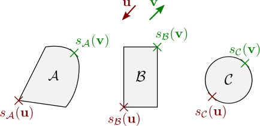

# Geometric representations
Different representations of geometric objects will lead to different
algorithms. At the moment **ncollide** relies a lot on convex shapes
described by a support function.  However, working exclusively with this kind
of shape is too restrictive. This is why **ncollide** provides the
[Compound](../geometric_representations/composite_shapes.html#compound) shape
that allows the construction of a concave shape from its convex parts, and
[Meshes](../geometric_representations/simple_shapes.html#mesh) that allows
the construction of a concave shape from triangles (in 3D) or segments (in 2D).

## Traits
The main trait that is implemented by every single shape is the `Shape`
trait. It requires each implementor to implement some other traits:
* `HasAABB` − an [Axis Aligned Bounding Box](../bounding_volumes/aabb.html) must
  be computable for the implementor.
* `HasBoundingSphere` − a
  [BoundingSphere](../bounding_volumes/bounding_sphere.html) must be computable
  for the implementor.
* `RayCast` − the computation of [intersections](../ray_casting/index.html)
  between a ray and the implementor must be possible.
* `PointQuery` − the implementor must support several common [point-related
  queries](../point_queries/index.html) like distance to a point, projection of
  a point, and point-inclusion test.

The `Volumetric` trait, though not required by `Shape`, is implemented for most
shape. It exposes methods that compute the mass, center of mass, and angular
inertia tensor of the implementor. For some shape like the `Plane` it is not
implemented because it is meaningless.

## Support map
**ncollide** supports generic algorithms that work for any (possibly
user-defined) shape defined by a support map. Those include collision detection
and ray casting algorithms.  The support map of a shape $$\mathcal{A}$$ is a
function that returns the point $$\mathbf{p}$$ that maximises its dot product
with a given direction $$\mathbf{v}$$:

$$
s_\mathcal{A}(\mathbf{v}) = \arg \max\limits_{\mathbf{p} \in \mathcal{A}} \left< \mathbf{p}, \mathbf{v} \right>
$$

This can be seen as a function that returns a point of the support mapped shape
which is _the furthest on the given direction_. Such a function is enough to
describe completely a convex object.  Here is an example of support points for
the shapes $$\mathcal{A}, \mathcal{B}$$ and $$\mathcal{C}$$, given two directions
($$\bf u$$ and $$\bf v$$):

The support mapping function is exposed by the `support_map::SupportMap` trait.

| Method                            | Description |
|--                                 | --          |
| `.support_point(m, v)`            | Computes the support point of the caller transformed by the transformation matrix `m`, in the direction `v`. |
