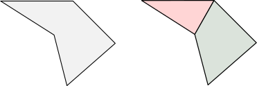
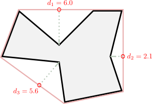
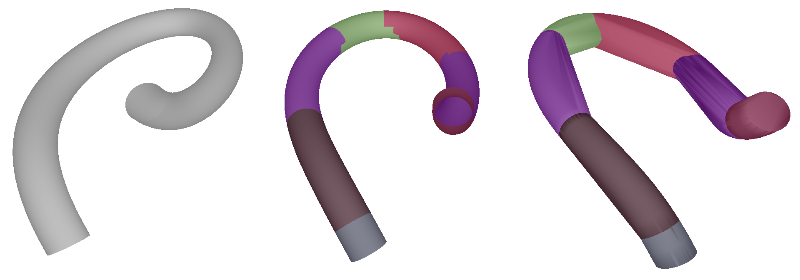

# Convex decomposition

As you might have noticed, a large variety of objects supported by **ncollide**
are convex. This is so because
[convex](../geometric_representations/simple_shapes.html#convex) objects
have nice properties that help designing efficient algorithms. However, studies
show that using only convex objects leads to very boring applications! That is
why **ncollide** allows the description of concave objects from its convex
parts using the
[`Compound`](../geometric_representations/composite_shapes.html#compound)
shape. For example, one could describe the following object as the union of
two convex parts:

<center>

</center>

But decomposing manually a concave polyhedra into its convex parts is a very
tedious task and computing an exact convex decomposition is often not
necessary. That is why **ncollide** implements Khaled Mamou 3D
[HACD](http://kmamou.blogspot.fr/2011/10/hacd-hierarchical-approximate-convex.html)
algorithm that computes an **approximate** convex decomposition. It is not yet
implemented in 2D.


## HACD

The HACD is simply a clustering algorithm based on a concavity criterion to
separate the different groups. It will group triangles together until the
directional distances between their vertices and their convex hull do not
exceeding an user-defined limit.

To compute the decomposition of a triangle mesh, use the `procedural::hacd`
function. It takes three arguments:

| Argument         | Description |
| --               | --          |
| `mesh`           | The `TriMesh` to decompose. It must have normals. Disconnected components of the mesh will not be merged together. |
| `error`          | The maximum _normalized concavity_ per cluster. It must **not** be close to a limit value like `Bounded::max_value()`. Values around 0.03 seems to give fine results for most objects. |
| `min_components` | Force the algorithm not to generate more than `min_components` convex parts. |

Let us define what _normalized concavity_ means. Because there is no official
definition of the concavity of a 3D object, we are using the maximal distance
between the triangle mesh vertex and its convex hull. This distance $$d$$ is
computed along the direction of the vertex normal:

<center>

</center>

Then, to make this concavity measure kind of independent from the whole shape
dimensions, it is divided by the object AABB diagonal $$D$$:

<center>

</center>

We call the ratio $$\frac{d}{D}$$ the _normalized concavity_. In this example,
it is equal to $$\frac{6.0}{10.0} = 0.6$$.


The `procedural::hacd` function returns a tuple. The first member of this
result is the set of convex objects that approximate the input mesh. Its second
member is the set of indices of the triangles used to compute each convex
object.


The following figure shows a tube (left), the result of the clustering done by
the HACD algorithm (middle), and the resulting convex decomposition (right):



## Example <span class="d3" onclick="window.open('../src/hacd3d.rs')" ></span>

The following example creates a concave object using a
[path-based](../mesh_generation/paths.md) mesh generation and approximates it
using the HACD algorithm. Together with
[kiss3d](http://github.com/sebcrozet/kiss3d), this code was used to generate
the last figure.

```rust
let control_points = [
    Vec3::new(0.0f32, 1.0, 0.0),
    Vec3::new(2.0f32, 4.0, 2.0),
    Vec3::new(2.0f32, 1.0, 4.0),
    Vec3::new(4.0f32, 4.0, 6.0),
    Vec3::new(2.0f32, 1.0, 8.0),
    Vec3::new(2.0f32, 4.0, 10.0),
    Vec3::new(0.0f32, 1.0, 12.0),
    Vec3::new(-2.0f32, 4.0, 10.0),
    Vec3::new(-2.0f32, 1.0, 8.0),
    Vec3::new(-4.0f32, 4.0, 6.0),
    Vec3::new(-2.0f32, 1.0, 4.0),
    Vec3::new(-2.0f32, 4.0, 2.0),
];
let bezier      = procedural::bezier_curve(control_points, 100);
let mut path    = PolylinePath::new(&bezier);
let pattern     = procedural::unit_circle(100);
let mut pattern = PolylinePattern::new(&pattern, true, NoCap::new(), NoCap::new());
let mut trimesh = pattern.stroke(&mut path);

trimesh.recompute_normals();

let (decomp, partitioning) = procedural::hacd(trimesh.clone(), 0.03, 0);

// We end up with 7 convex parts.
assert!(decomp.len() == 7);
assert!(partitioning.len() == 7);
```
