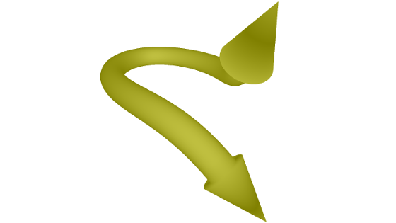

# Paths

Path-based mesh generation exposed by the `procedural::path` module allows you
to create more complex shapes by replicating a pattern along a path. Note that
this feature is still extremely immature and at most incomplete. Use with care.

<center>

</center>

The path-based mesh generation API is based on two traits. The
`procedural::path::CurveSampler` trait is implemented by a structure that is
capable of generating a path (i.e. a set of points assumed to form a polyline).


| Method    | Description                         |
| --        | --                                  |
| `.next()` | Returns the next point of the path. |

The returned point may be either a `procedural::path::StartPoint`, an
`InnerPoint` or an `EndPoint`. If `EndOfSample` is returned, then the
path generation is assumed to be completed. There may be several pairs of
`StartPoint, InnerPoint` inside of the same path. This allows patterns like
dashed lines.


Together with the path, we need the pattern that will be  replicated at each
point of the path. Such pattern must implement the
`procedural::path::StrokePattern` trait.

| Method         | Description                                     |
| --             | --                                              |
| `stroke(path)` | Strokes the `path` using `self` as the pattern. |

The stroke pattern is responsible for the mesh generation itself. It has to
duplicate its pattern at each point of the path, and to link those duplicates
correctly to form a topologically sound `TriMesh`. This allows you to easily
stroke paths with possibly very different shapes and connectivity using the
same pattern.

## Example <span class="d3" onclick="window.open('../src/path.rs')"></span>
The following example uses the `procedural::path::PolylinePath` together with
the `procedural::path::PolylinePattern` to stroke the arrowed Bézier curve
shown at the beginning of this section.

```rust
let control_points = [
    Pnt3::new(0.0f32, 1.0, 0.0),
    Pnt3::new(2.0f32, 4.0, 2.0),
    Pnt3::new(2.0f32, 1.0, 4.0),
    Pnt3::new(4.0f32, 4.0, 6.0),
    Pnt3::new(2.0f32, 1.0, 8.0),
    Pnt3::new(2.0f32, 4.0, 10.0),
    Pnt3::new(0.0f32, 1.0, 12.0),
    Pnt3::new(-2.0f32, 4.0, 10.0),
    Pnt3::new(-2.0f32, 1.0, 8.0),
    Pnt3::new(-4.0f32, 4.0, 6.0),
    Pnt3::new(-2.0f32, 1.0, 4.0),
    Pnt3::new(-2.0f32, 4.0, 2.0),
];

// Setup the path.
let bezier   = procedural::bezier_curve(control_points, 100);
let mut path = PolylinePath::new(&bezier);

// Setup the pattern.
let start_cap   = ArrowheadCap::new(1.5f32, 2.0, 0.0);
let end_cap     = ArrowheadCap::new(2.0f32, 2.0, 0.5);
let pattern     = procedural::unit_circle(100);
let mut pattern = PolylinePattern::new(&pattern, true, start_cap, end_cap);

// Stroke!
let _ = pattern.stroke(&mut path);
```
