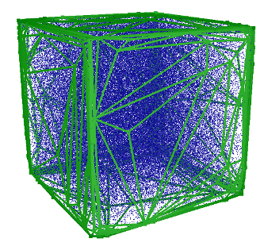

# Primitives

Besides the `ToTriMesh` and `ToLinestrip` traits, the `procedural` module
exports free functions that generates various meshes and line strips, including
those accessible by the two former traits.

It also exposes functions to compute the convex hull of a set of point using
the [QuickHull algorithm](http://en.wikipedia.org/wiki/QuickHull) which has an
average $$O(n \log{n})$$ time complexity.  Because computing the convex hull of
2d and 3d shapes is so common, two functions are always available no
matter the number of dimensions you chose to compile **ncollide** for:

| Function             | Description                                     |
| --                   | --                                              |
| `convex_hull2d(...)` | Computes the convex hull of a set of 2D points. |
| `convex_hull3d(...)` | Computes the convex hull of a set of 3D points. |

If you are not interested in the `Polyline` representation of the 2D convex
hull but only on the original indices of the vertices it contains, use the
`_idx` variant of the function − namely `convex_hull2d_idx(...)`.

## Example
Le following example creates 100,000 random points and compute their
convex hull.

###### 2D example <span class="d2" onclick="window.open('../src/primitives2d.rs')"></span>
```rust
let mut points = Vec::new();
for _ in range(0u, 100000) {
    points.push(rand::random::<Vec2<f32>>() * 2.0f32);
}

let convex_hull = procedural::convex_hull2d(points.as_slice());
```

###### 3D example <span class="d3" onclick="window.open('../src/primitives3d.rs')"></span>
```rust
let mut points = Vec::new();
for _ in range(0u, 100000) {
    points.push(rand::random::<Vec3<f32>>() * 2.0f32);
}

let convex_hull = procedural::convex_hull3d(points.as_slice());
```

<center>

</center>
