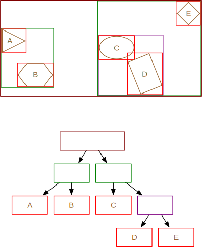

## Acceleration structures

Without an efficient spacial partitioning structure, we would not be able to
ray-trace a complex scene with millions of triangles like this one (6,704,264
triangles):

<center>

</center>

If your objects can move, you may use a [broad
phase](../contact_determination/broad_phase.html) that implements the
`broad::RayCastBroadPhase` trait. A lighter, often simpler, alternative is to
use the `partitioning::DBVT` structure directly (it is used by one
of the broad phase algorithms).

If your objects do not move, the `partitioning::BVT`  will be more efficient.

## The BVT
For a static scene, better performances will be achieved by an immutable
spacial partitioning structure. At the moment, the only one implemented by
**ncollide** is the Bounding Volume Tree `BVT`. For example, the following
figure depicts a set of 2D objects (brown), their AABB (black) and the
corresponding AABB Tree (one color per depth):

<center>

</center>

Note that, even if this example uses AABB, the `BVT` is generic with regard to
the type of bounding volume (e.g. we could use bounding spheres instead).

#### Creating a BVT
Because the BVT is an immutable data structure, it must be created at once and
cannot be modified after. The `::new_with_partitioner(...)` is its main
constructor and requires a list of tuples containing the objects that will be
stored on the BVT leaves and their bounding volumes. The objects themselves do
not have to implement any specific trait. The other requirement is a
partitioning scheme that will, given an array of bounding volumes, split them
into two groups. This splitting process is known as the _top-down_ tree
construction approach. One example of such partitioning scheme is
`partitioning::balanced_partitionner(...)` that will distribute the objects
depending on their bounding volumes position along one axis relative to their
median. This will generate a balanced tree.

The second constructor of the BVT is `::new_balanced(...)` which simply invokes
`::new_with_partitioner(...)` with your objects and the
`balanced_partitionner(...)`.

#### Using a BVT

There are two ways of using the BVT for ray casting. The first one is using the
`partitioning::RayInterferencesCollector` visitor:

```rust
let bvt           = BVT::new_balanced(your_objects);
let intersections = Vec::new();

{
    let visitor = RayInterferencesCollector::new(&bvt, &mut intersections);
    bvt.visit(&mut visitor);
}

// Now `intersections` contains the list of all objects which bounding volume intersects the ray.
```

If you are not interested in the whole set of objects that intersect the ray
but only the closest one, using the BVT `.cast_ray(...)` method will be far
more efficient. It requires a closure that is able to cast a ray on the
objects and returns a tuple containing the associated time of impact (in any)
and an user-defined result. The end-result is the user-defined one that had the
smallest time of impact.

## Example

The following examples creates four geometries, sets up a `BVT` to associate
indices to their bounding spheres, and casts some rays on it using the
`.ray_cast(...)` method and the `RayInterferencesCollector` visitor.

###### 2D example <span class="d2" onclick="window.open('../src/ray_bvt2d.rs')"></span>
```rust
let ball = Ball::new(0.5);
let caps = Capsule::new(0.5, 0.75);
let cone = Cone::new(0.5, 0.75);
let cube = Cuboid::new(Vec2::new(1.0, 0.5));

let geoms = [
    &ball as &Geom,
    &caps as &Geom,
    &cone as &Geom,
    &cube as &Geom
];

let poss = [
    Iso2::new(Vec2::new(1.0, 0.0), na::zero()),
    Iso2::new(Vec2::new(2.0, 0.0), na::zero()),
    Iso2::new(Vec2::new(3.0, 0.0), na::zero()),
    Iso2::new(Vec2::new(4.0, 2.0), na::zero())
];

let idx_and_bounding_spheres  = vec!(
    (0u, geoms[0].bounding_sphere(&poss[0])),
    (1u, geoms[1].bounding_sphere(&poss[1])),
    (2u, geoms[2].bounding_sphere(&poss[2])),
    (3u, geoms[3].bounding_sphere(&poss[3]))
);

let bvt      = BVT::new_balanced(idx_and_bounding_spheres);
let ray_hit  = Ray::new(na::zero(), Vec2::x());
let ray_miss = Ray::new(na::zero(), -Vec2::x());

/*
 * Ray cast using a callback.
 */
let mut cast_fn = |id: &uint, ray: &Ray| {
    geoms[*id].toi_with_transform_and_ray(&poss[*id], ray, true).map(|toi| (toi, toi))
};

assert!(bvt.cast_ray(&ray_hit, &mut cast_fn).is_some());
assert!(bvt.cast_ray(&ray_miss, &mut cast_fn).is_none());

/*
 * Ray cast using a visitor.
 */
let mut collector_hit:  Vec<uint> = Vec::new();
let mut collector_miss: Vec<uint> = Vec::new();

// We need a new scope here to avoid borrowing issues.
{
    let mut visitor_hit  = RayInterferencesCollector::new(&ray_hit, &mut collector_hit);
    let mut visitor_miss = RayInterferencesCollector::new(&ray_miss, &mut collector_miss);

    bvt.visit(&mut visitor_hit);
    bvt.visit(&mut visitor_miss);
}

assert!(collector_hit.len()  == 3);
assert!(collector_miss.len() == 0);
```

###### 3D example <span class="d3" onclick="window.open('../src/ray_bvt3d.rs')"></span>
```rust
let ball = Ball::new(0.5);
let caps = Capsule::new(0.5, 0.75);
let cone = Cone::new(0.5, 0.75);
let cube = Cuboid::new(Vec3::new(1.0, 0.5, 1.0));

let geoms = [
    &ball as &Geom,
    &caps as &Geom,
    &cone as &Geom,
    &cube as &Geom
];

let poss = [
    Iso3::new(Vec3::new(0.0, 0.0, 1.0), na::zero()),
    Iso3::new(Vec3::new(0.0, 0.0, 2.0), na::zero()),
    Iso3::new(Vec3::new(0.0, 0.0, 3.0), na::zero()),
    Iso3::new(Vec3::new(0.0, 2.0, 4.0), na::zero())
];

let idx_and_bounding_spheres  = vec!(
    (0u, geoms[0].bounding_sphere(&poss[0])),
    (1u, geoms[1].bounding_sphere(&poss[1])),
    (2u, geoms[2].bounding_sphere(&poss[2])),
    (3u, geoms[3].bounding_sphere(&poss[3]))
);

let bvt      = BVT::new_balanced(idx_and_bounding_spheres);
let ray_hit  = Ray::new(na::zero(), Vec3::z());
let ray_miss = Ray::new(na::zero(), -Vec3::z());

/*
 * Ray cast using a callback.
 */
let mut cast_fn = |id: &uint, ray: &Ray| {
    geoms[*id].toi_with_transform_and_ray(&poss[*id], ray, true).map(|toi| (toi, toi))
};

assert!(bvt.cast_ray(&ray_hit, &mut cast_fn).is_some());
assert!(bvt.cast_ray(&ray_miss, &mut cast_fn).is_none());

/*
 * Ray cast using a visitor.
 */
let mut collector_hit:  Vec<uint> = Vec::new();
let mut collector_miss: Vec<uint> = Vec::new();

// We need a new scope here to avoid borrowing issues.
{
    let mut visitor_hit  = RayInterferencesCollector::new(&ray_hit, &mut collector_hit);
    let mut visitor_miss = RayInterferencesCollector::new(&ray_miss, &mut collector_miss);

    bvt.visit(&mut visitor_hit);
    bvt.visit(&mut visitor_miss);
}

assert!(collector_hit.len()  == 3);
assert!(collector_miss.len() == 0);
```
